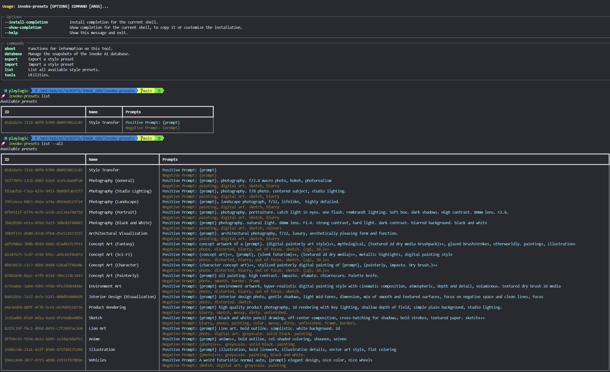

# Invoke Preset CLI


> [!IMPORTANT]
> This tool makes changes to the Invoke AI database and while it does make snapshots before operations
> that write to a table, there is always a chance the data could be come corrupted. You the stand-alone
> commands to make backups or external tools.

## Overview

**Invoke Preset CLI** is a simple CLI tool that streamlines the process of managing large
entries of presets into the Invoke AI. The tool was primarily designed to allow me to quickly
add, update, and delete presets in bulk.




## Why

Just wanted a easy way to get styles in and out of the database without having to use the web interface.


## Installation (Recommended)

You have a couple of options for installing/running the tool:

### Install [pipx](https://pipxproject.github.io/pipx/installation/), then run the tool with the following command

```bash
pipx install .
```

### Alternatively, you can install using `pip`

```bash
pip install .
```

## Configuration

> [!IMPORTANT]
> Before using the tool, It's required to set up a `.env` file in the parent directory of the script or your home user dir [windows] or `$HOME/.config/invoke-presets-itsjustregi/.env`

The application intelligently locates your `.env` file, accommodating various platforms like Windows and Linux, or defaulting to the current directory.

## Usage // Available Commands

Once installed via pipx or pip:

```
invoke-presets --help
```


## Dependencies

This tool requires Python 3.11 or higher and has the following dependencies:

```bash
"typer",
"rich",
"shellingham",
"python-dotenv",
"inquirer",
"packaging",
"sqlite-utils",
"pytest"
```

### Contact

For any inquiries, feedback, or suggestions, please feel free to open an issue on this repository.

### License

This project is licensed under the [MIT License](LICENSE).

---
